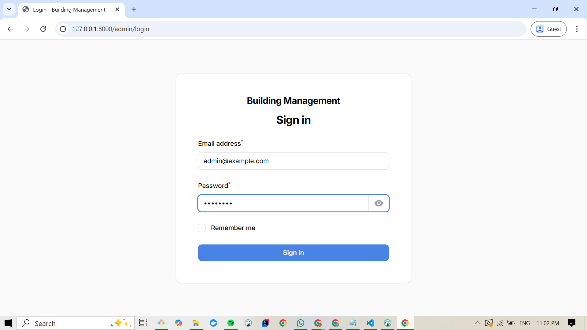

# 🏢 Building Management System

Aplikasi **Building Management System** berbasis Laravel untuk mengelola properti kos/apartemen dengan tiga jenis role utama: **Admin**, **Penyewa**, dan **Customer**.  
Project ini menggunakan **Laravel**, **Filament**, **Blade**, **TailwindCSS**, dan **PostgreSQL** sebagai database utama.

---

## 📌 Tech Stack

- **Framework Backend**: Laravel 10+
- **UI Library**: Blade + TailwindCSS
- **Admin Panel**: FilamentPHP
- **Database**: PostgreSQL
- **PHP**: ^8.2
- **Composer**: 2.x
- **Node.js**: ^22.x

---

## ⚡ Fitur Utama

### 👨‍💼 Admin
- Monitor booking, payment, order history (read-only)
- Monitor properties (read-only)
- User management (reset password, dsb)

### 🏠 Penyewa
- CRUD properti (kos, apartemen)
- Booking management untuk properti miliknya
- Update status booking
- Konfirmasi pembayaran manual
- Menerima notifikasi booking baru

### 👤 Customer
- Registrasi & login
- Cari & lihat properti
- Booking properti dengan memilih tanggal sewa
- Pembayaran (upload bukti transfer manual)
- Dashboard transaksi & history booking
- Memberi rating & review properti
- Menerima notifikasi pembayaran & reminder

---

## 🗄️ Database Schema (ERD)

Struktur tabel utama:

- **users** → menyimpan akun (admin, penyewa, customer)
- **properties** → data properti kos/apartemen
- **property_images** → galeri foto properti
- **property_change_requests** → permintaan create/update/delete dari penyewa
- **bookings** → data booking customer
- **payments** → data pembayaran booking
- **reviews** → ulasan customer terhadap booking
- **notifications_apps** → notifikasi sistem untuk user
- **schedules** → jadwal ketersediaan properti

👉 [Tambahkan gambar ERD di sini]

---

## 🚀 Installation Guide

### 1. Clone Repository
```bash
git clone https://github.com/username/building-management.git
cd building-management
```

### 2. Install Dependencies
```bash
composer install
npm install && npm run dev
```

### 3. Setup Environment
Copy file `.env.example` menjadi `.env`:

```bash
cp .env.example .env
```

Lalu sesuaikan konfigurasi database (PostgreSQL):
```env
DB_CONNECTION=pgsql
DB_HOST=127.0.0.1
DB_PORT=5432
DB_DATABASE=building_management
DB_USERNAME=postgres
DB_PASSWORD=your_password
```

### 4. Generate Key
```bash
php artisan key:generate
```

### 5. Migrate & Seed Database
```bash
php artisan migrate --seed
```

### 6. Run Server
```bash
php artisan serve
```

Aplikasi bisa diakses di:
```
http://127.0.0.1:8000
```

---

## 🔑 Default Accounts (Seeder)
Gunakan akun ini untuk testing (jika ada di seeder):

- **Admin**
  - Email: `admin@example.com`
  - Password: `password`

- **Penyewa**
  - Email: `penyewa@example.com`
  - Password: `password`

- **Customer**
  - Email: `customer@example.com`
  - Password: `password`

---

## 📸 Screenshots

👉 Tambahkan screenshot sesuai kebutuhan:
- Dashboard Admin

- Dashboard Penyewa

- Dashboard Customer

- Proses booking

- Pembayaran

- Transaction History


---

## 📂 Project Structure (high-level)
```bash
app/
├── Models/         # Model Eloquent (User, Property, Booking, dsb)
├── Http/
├── Filament/
│   ├── Controllers/ # Controller untuk role & fitur
│   ├── Middleware/  # Role-based access middleware
database/
├── migrations/     # Migrasi database
├── seeders/        # Data awal (roles, akun demo)
resources/
├── views/          # Blade template
├── css/            # Tailwind CSS
routes/
├── web.php         # Route utama
```

